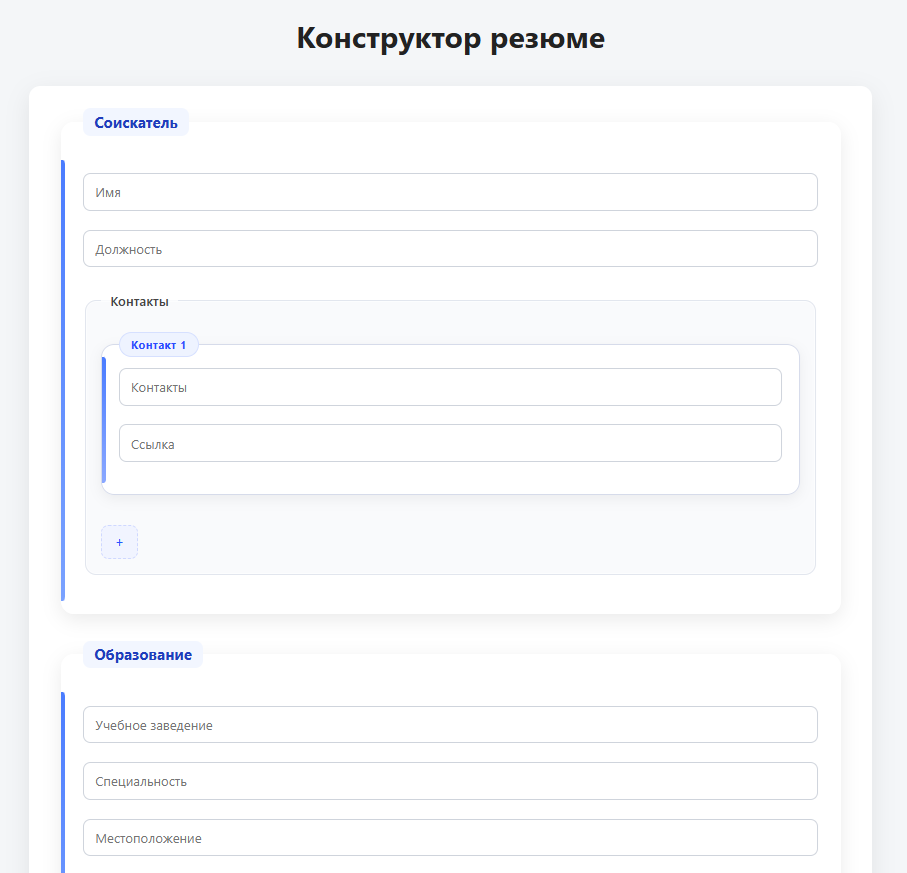
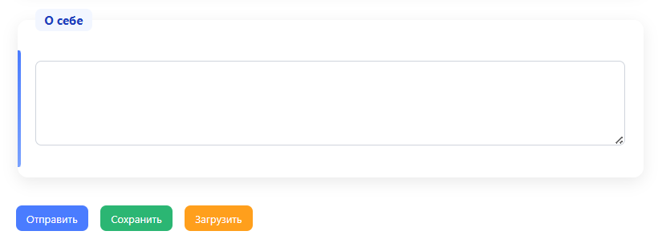
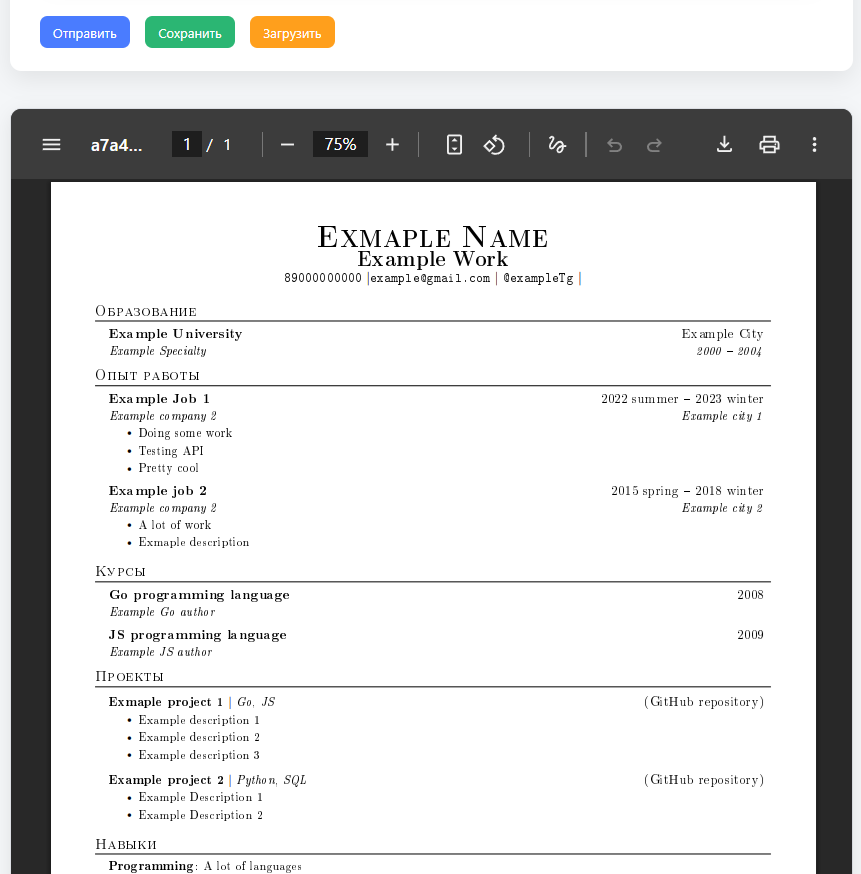

# Конструктор резюме

Это приложение позволяет пользователю вводить информацию о себе, например учебное заведение, опыт работы, навыки и т.п. и получать резюме в формате pdf.

## Об интерфейсе
Интерфейс страницы с созданием резюме выглядит следующим образом:

Здесь пользователь может заполнять каждый отдельный блок (О себе, об опыте работы, о навыках т.д.), может добавлять определённые блоки, например добавить ещё один блок с контактами, для этого надо нажать на "плюсик".

В конце страницы есть кнопки "Отправить", "Сохранить" и "Загрузить".

Разберём их функционал.

### Сохранить
Кнопка "Сохранить" сохраняет введённую пользователем информацию в локальном хранилище браузера. Обратите внимание, что сохранить можно только один экземпляр резюме, другими словами, если нажать кнопку "Сохранить", старые данные перезапишутся новыми.

### Загрузить
Кнопка "Загрузить" загружает сохранённые в локальном хранилише браузера данные на страницу. Обратите внимание, что уже записанные в поля данные в таком случае стираются, и вместо них появляются загруженные данные.

Хочется заметить, что пустые, незаполненные, поля в конструкторе резюме не учитываются, эти поля приложение просто игнорирует.

### Отправить

Кнопка "Отправить" отправляет данные на сервер, который затем преобразует их в резюме в формате pdf. После этого сервер отправляет созданный pdf файл обратно клиенту, и этот файл выводится ниже всех полей с данными пользователя. Пример на картинке ниже:

Предпросмотр резюме выполняется с помощью встроенного в бразуер pdf viewer'а, скачать резюме можно так же с помощью этого viewer'а.

## Дополнительно

Подробнее почитать про backend и frontend части приложения можно в файлах README.md соответсвенно в директориях backend и frontend.